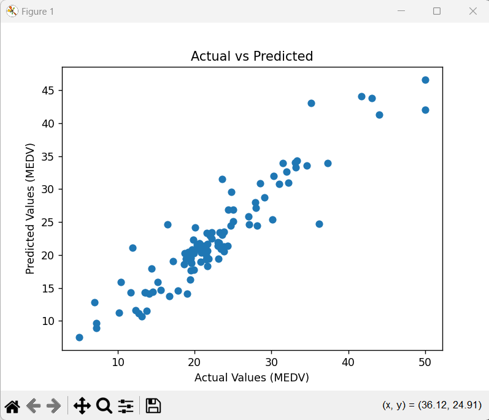
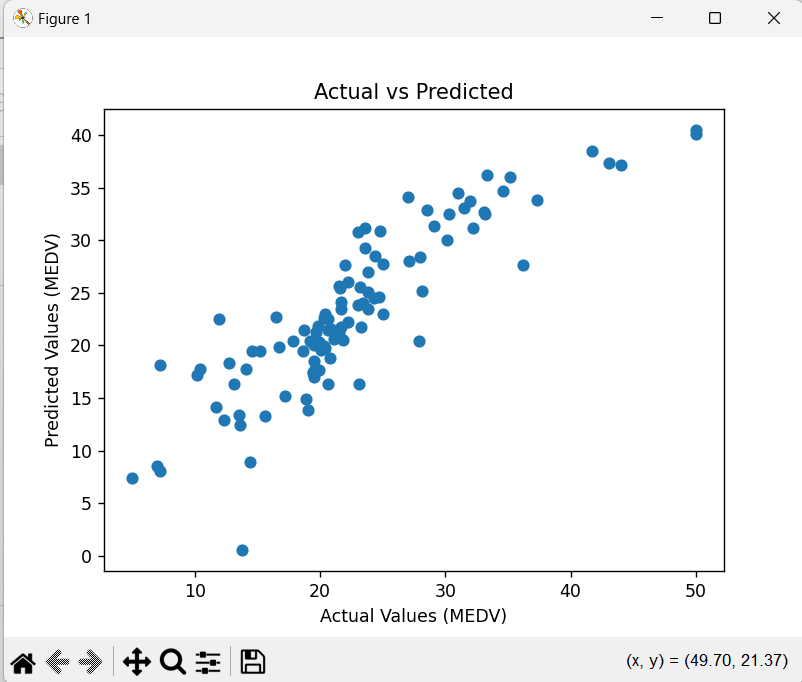
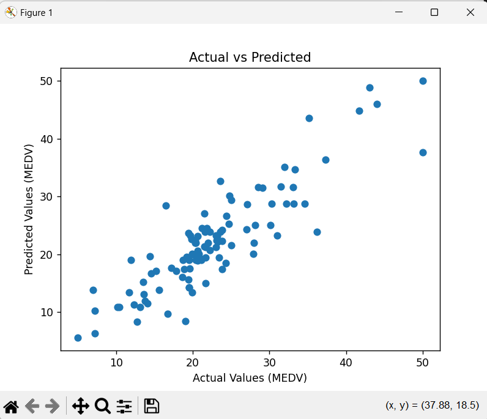

# Housing Price Prediction

This repository contains a machine learning project aimed at predicting house prices in Boston using the famous Boston housing dataset. The project implements and compares three different regression models: **Random Forest Regressor**, **Linear Regression**, and **Decision Tree Regressor**. Additionally, the repository includes metrics like RMSE (Root Mean Squared Error) for each model and visualizations of the predicted versus actual values.

## Table of Contents

- [Introduction](#introduction)
- [Dataset](#dataset)
- [Models Implemented](#models-implemented)
- [Results](#results)
- [Installation](#installation)
- [Usage](#usage)
- [Visualizations](#visualizations)
- [Conclusion](#conclusion)
- [License](#license)

## Introduction

In this project, we apply various machine learning models to predict the median value of owner-occupied homes (denoted as `MEDV`) in the Boston area. The features used in this dataset include characteristics like the number of rooms, tax rate, accessibility to highways, and more. We use a combination of stratified train-test splitting, data preprocessing pipelines, and feature engineering to build effective regression models.

## Dataset

The dataset used in this project is the Boston Housing dataset. This data contains information about housing in Boston, with various attributes like:

- **RM**: Average number of rooms per dwelling.
- **TAX**: Full-value property tax rate per $10,000.
- **CHAS**: Charles River dummy variable (1 if tract bounds river; 0 otherwise).
- **MEDV**: Median value of owner-occupied homes in $1000s (our target variable).

We use a **Stratified Shuffle Split** to divide the dataset into training and testing sets, ensuring that the proportion of homes near the Charles River (`CHAS` variable) remains consistent across both sets.

## Models Implemented

Three machine learning models are implemented and compared:

1. **Random Forest Regressor**
2. **Linear Regression**
3. **Decision Tree Regressor**

The models were evaluated using RMSE (Root Mean Squared Error) and visualized with predicted vs actual values and residual plots.

## Results

The performance of each model is summarized below based on RMSE:

| Model                   | RMSE         |
|--------------------------|--------------|
| Random Forest Regressor   | 2.9151637208925063 |
| Linear Regression         | 4.143874870573363 |
| Decision Tree Regressor   | 4.003882919288793 |

The RMSE values can be found in the `RMSE.txt` file in this repository.

## Installation

### Prerequisites

To run this project, you will need to install the following Python packages:

```bash
pip install numpy pandas scikit-learn matplotlib
```

### Clone the Repository

To get started, clone this repository to your local machine:

```bash
git clone https://github.com/Binduvarsha23/House_Price_Detection
```

## Usage

1. **Train the Models**: You can run the code in the `boston_housing.py` file to train the models on the dataset.
2. **Evaluate the Models**: After training, the code will output the RMSE for the test set and display the visualizations.

Run the project as follows:

```bash
python boston_housing.py
```

This will also generate:

- **Actual vs Predicted scatter plot** for each model.
- **Residuals distribution plot** for each model.

The trained model (Random Forest) is saved as `Dragon.joblib` for future predictions.

## Visualizations

- **Random Forest**: 
- **Linear Regression**: 
- **Decision Tree**: 

The plots compare the actual `MEDV` values with the predicted values from each model.

### Residual Distribution

A histogram of the residuals (errors) is also provided for each model to analyze the model's accuracy.

## Conclusion

In this project, we compared three regression models for predicting Boston housing prices. Based on the RMSE and residuals, the **Random Forest Regressor** performed the best, though the exact comparison can be reviewed in the results section.

### Key Learnings:
- Preprocessing pipelines make data preparation efficient.
- Random Forest is robust for regression problems with tabular data.
- Visualizing residuals helps in assessing model accuracy.

## License

This project is licensed under the MIT License - see the [LICENSE](LICENSE) file for details.
